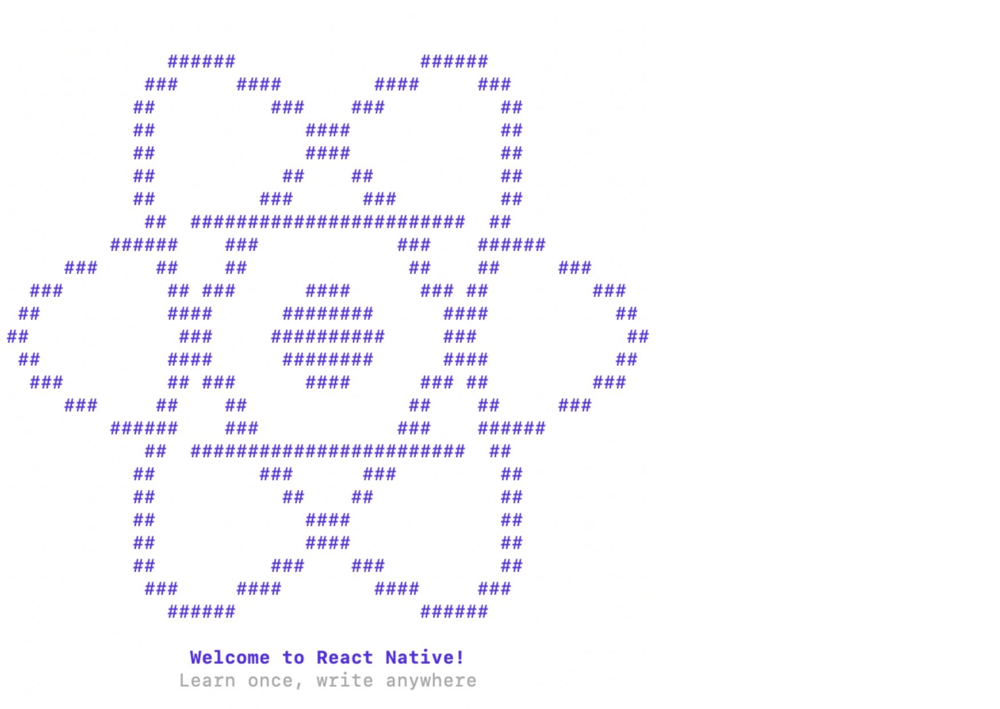

## Mobile automation baked into the entire pipeline from start to finish using Detox - ReactNative & App Center

Having the right test automation is the key for success of any Product. Testing your application from the perspective of an end user automatically, ensuring the quality of code , along with delivering it, on the right medium available.

There are various tools when it comes to web automation like Cypress, Webdriverio and many others. But when it comes to the mobile, automation is not that common.
The reason for writing an article on mobile automation is to explain how to achieve and implement end to end testing of mobile using Detox and integration with CI/CD pipeline like Appcenter for distribution.

## Why Detox?

Detox an End to End testing library for applications which are developed using React Native and for pure native applications. It allows mobile tests to be performed by running a real device/simulator and showcasing the interaction like a real User.
Less flaky
Cross Platform, supports both android and ios
Debuggable
Made for CI

_**Note: Lets focus on iOS, otherwise the length of the article will become too long.**_

The following React Native versions have been tested:
iOS
Android
<=0.62
<=0.56 - Full support

> =0.57 <=0.62 - Visibility edge-case: see this RN issue\*

### Let's get Started

#### Prerequisites:

<br>- Mac with macOS
</br>

<br>- Xcode
</br>

#### Create a sample react-native application

<br> 1. Install react-native

```sh
$ npm install react-native -g
```

</br>

<br> 2. Setup react-native via command line

```sh
$ npx react-native init <project_Name>
```

</br>



<br> 3. Launch the app by navigating within your project

```sh
$ react-native run-ios
```


</br>

<br> 4. Install the latest version of HomeBrew

```sh
$ brew tap wix/brew
```

</br>

<br> 5. Install the latest version of applesimutils

```sh
$ brew install applesimutils
```

</br>

<br> 6. Install Detox command line tool

```sh
$ npm install -g detox-cli
```

</br>

<br> 7. Add Detox as a dev dependency for the project

```sh
$ yarn add detox -D
```

</br>

#### Add Detox configuration

Lets add detox configuration in your project.Always try keeping the detox configuration seperate in your package.json file.
I have added 2 configuration, one incase of debug mode to run it locally and one in release mode, while trying to integrate it with a CI/CD pipeline.

```json
"detox": {
    "configurations": {
      "ios.sim.debug": {
        "binaryPath": "ios/build/Build/Products/Debug-iphonesimulator/DetoxTest.app",
        "build": "xcodebuild -workspace ios/DetoxTest.xcworkspace -scheme Staging -configuration Debug -sdk iphonesimulator -derivedDataPath ios/build",
        "type": "ios.simulator",
        "device": {
          "type": "iPhone 11 Pro"
        }
      },
      "ios.sim.release": {
        "binaryPath": "ios/build/Build/Products/Release-iphonesimulator/DetoxTest.app",
        "build": "export RCT_NO_LAUNCH_PACKAGER=true && xcodebuild -workspace ios/DetoxTest.xcworkspace -scheme Staging -configuration Release -sdk iphonesimulator -derivedDataPath ios/build -quiet",
        "type": "ios.simulator",
        "device": {
          "type": "iPhone 11 Pro"
        }
      }
    },
    "test-runner": "jest",
    "runner-config": "e2e/config.json"
  }
}
```

Now, lets install a one of the framework either jest or mocha.

<br> 1. Install detox-cli for jest or mocha

```sh
$ detox init -r jest
```

OR

```sh
$ detox init -r mocha
```

It will create a e2e folder in your project, with some basic test files which allows you to start writing your first script, init.js and some config files, wherein you can mention the type of reporting required.

There are various reporters available, but I tried using jest-stare as it gives reports in both html and json format.

<br> 2. Install [jest-stare](https://www.npmjs.com/package/jest-stare) reporting

```sh
$ npm i jest-stare
```

</br>

<br> Now, change the `config.json` file to use the reporter you just added. By defining the jest-stare reporter, e.g
</br>

```json
"reporters": ["../node_modules/jest-stare"]
```

Its always important to maitain the folder structure, so that the effort is always streamlined, hence better to keep common things together. I have tried keeping the specs in one folder and user data in a seperate json file. Let's do it!

<br>- Create sub-folder under e2e naming it specs and add all the specs file underneath
</br>

```
e2e
├── specs
```

<br>- Create a json file under e2e mentioning it as users.json, wherein you will store all the user related information. As a part of testing we always need to keep in mind of having seperate user data for each environment. Why not make it configurable? Lets do that
</br>

```
e2e
├── specs
└── user.json
```

```json
{
  "dev": {
    "devLoginDetails": {
      "username": "abc@gmail.com",
      "password": "12345"
    }
  },
  "stage": {
    "stgLoginDetails": {
      "username": "cdf@gmail.com",
      "password": "98765"
    }
  }
}
```

<br> - Now, lets create a environment file and name it `testEnvConfig.js` wherein you will mention the environment specific data, like in our case we have users specific to environment
</br>

```js
process.env.ENV_NAME = "dev"
```

<br>- Add, testID for the element you want to perform action now. Move to the source code of your project, identify the element and add testID like below:
</br>

```
  testID={'basics'}
```

<br>- We shall now modify our `firstTest.e2e.js` to verify some elements from the react welcome page
</br>

```js
describe("Verify the react welcome page elements", () => {
  beforeEach(async () => {
    await device.reloadReactNative()
  })

  it("should have welcome screen", async () => {
    await expect(element(by.id("welcome"))).toBeVisible()
  })

  it("should be able to click on basics link", async () => {
    await element(by.id("basics")).tap()
    await expect(element(by.text("The Basics"))).tap()
  })
})
```

<br>- Inorder to execute the tests, we first need to build the app using detox commands
</br>

```sh
$ detox:build
```

- Followed by the command to run tests under specs folder, use

```sh
$ detox:test e2e/specs
```

<br>- This will now generate jest-stare folder within your project, which will have html and json reporting file, mentioning all the failed and passed testcases. Along with detail summary for test scenarios under the specs file
</br>

## Whats next now?

Yes, as promised we will see the functional tests written in detox to be integrated with CI/CD tools like appcenter. Having a automation scripts is wonderful, but would it make sense if there are error in code and scripts fail. But your app getting delivering to various environment. The most important part of having automation scripts is to reduce manual effort and having automated deployment and failing the deployments incase of errors.

Every CI/CD has its own shell files. Incase of [appcenter](https://appcenter.ms/) we do have mutliple files for executing functions before build (post build), after build (pre-build), Post-clone and various others. Lets focus on `appcenter-pre-build.sh` file, wherein our app has started building, and then lets add our commands to execute E2E testing before building the app

<br>- Build the app via detox
</br>

```sh
echo "Building the project for Detox tests..."
npx detox build --configuration ios.sim.release
```

<br>- Step 2: Execute our E2E tests via Detox
</br>
But is that enough?

We still havent stopped the distribution of the app when your tests fails. Here's a solution provided by appcenter, wherein you can use appcenters openAPI to cancel the build, using the token

```sh
echo "Executing Detox tests..."
if npx detox test e2e/specs/firstspec.e2e.js --configuration ios.sim.release --cleanup; then
  echo "All tests succeeded"
else
  echo "Test failed"
  echo "Cancelling app center build"
  API_TOKEN="<UserToken>"
  OWNER_NAME="<ownerName>"
  APP_NAME="<appName>"
  curl -iv "https://appcenter.ms/api/v0.1/apps/$OWNER_NAME/$APP_NAME/builds/$APPCENTER_BUILD_ID" \
  -X PATCH \
  -d "{\"status\":\"cancelling\"}" \
  --header 'Content-Type: application/json' \
  --header "X-API-Token: $API_TOKEN"
  exit
fi
```

Wahoo!! We have successfully implemented our e2e with CI/CD..

## Summary

There are various elements that helps you perform different operations and actions of the device, the list is available [here](https://github.com/wix/Detox/blob/master/docs/README.md). Also tools like Detox, helps increase the speed and can be easily integrated with react native apps. The community is growing faster. Have you used Detox for mobile app testing?

> Happy using Detox!! 👻
